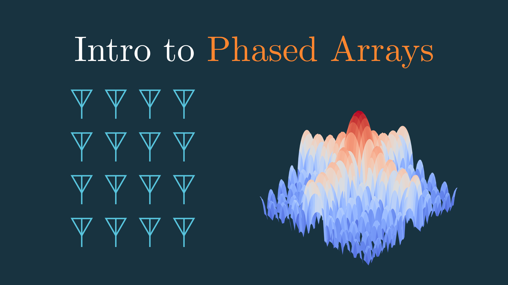

## Videos
Code for my videos focused on radar and RF engineering published to https://www.youtube.com/@MarshallBrunerRF

## License
The code and outputs in this repository are only for reference and not for use without permission. You probably wouldn't want to anyway - the code is pretty messy...

## [01 - What is FMCW Radar and why is it useful?](https://youtu.be/xUGWHGjCtII)

This video goes over range estimation with FMCW radar and gives a little insight into why you might want to use it over a traditional pulsed radar. 

There are many more trade-offs between the two that I don't discuss here, but this should give you a basic understanding of the technology. 

I'll use this as a basis for future videos on FMCW radar. There is a ton to cover and I'm excited to dive into those animations and explanations! 

## [02 - How do you build an FMCW Radar?](https://youtu.be/MlcydOwmRIY)

Have you ever looked at an FMCW radar block diagram and had no idea what the components do? 

In this video I attempt to clear this up a bit by going through a simplified block diagram and explaining the components, step-by-step. The video then takes a short detour into the digital domain where I briefly touch on the expansive world of radar signal processing. In this case I literally only go into any depth about the FFT, but I mention some of the other very exciting places DSP can take you! 

There are so many other applications and implementations of FMCW radar that this video could not possibly cover, so take all this information with a grain of salt and hopefully you'll go on to explore it further. 

## [03 - How RADARs use CFAR to detect targets](https://youtu.be/BEg29UuZk6c)

Constant false alarm rate - or CFAR - is easily one of the most well-known radar detection algorithms. 

This is due in part to its simplicity if implementation and relative effectiveness over using a static threshold or getting just saying the maximum values are the targets. It can also be used on different measurement types, and even in multiple dimensions (e.g., range, Doppler velocity, 2D range-Doppler spectrum).

In this video I go over the motivation, implementation, and some of the design knobs available when using CFAR.

## [04 - How do FMCW RADARs measure velocity?](https://youtu.be/G_tmNtP0gw8)

FMCW radars provide an excellent method for estimating range information of targets... but what about velocity? 

The velocity of a target is often obtained using the Doppler frequency shift it incurs. This gets more challenging once you start using frequency information to determine range because it is ambiguous whether the frequency shift is due to the range or velocity. 

In this video I introduce two methods for dealing with this issue and provide a python notebook to play around with the methods yourself.

## [05 - Phased Arrays - Steering and the Antenna Pattern](https://tinyurl.com/phased-array-part1-vid)

Traditional antennas need to physically move to track signals, but phased arrays change the game by steering beams electronically. How does this work? 

In this video, I’ll break down some key concepts:
- Near vs. far field
- How phased arrays steer signals using phase shifters
- The math behind beamforming and antenna patterns  
- 1D vs. 2D arrays 

## [06 - Explaining the Radar Range Equation | The Animated Radar Cheatsheet](https://youtu.be/UKbQcEZIKgc)

The Radar Range Equation is easily one of the most important equations to understand when learning about radar systems.

This video gives a brief overview of it and how to compute it with some real-world values. It's part of a larger series called "The Animated Radar Cheatsheet" which aims to be a good reference for radar engineers and make the equations more approachable.

## [07 - What is Radar Signal-to-Noise Ratio? | The Animated Radar Cheatsheet](https://youtu.be/e0M7FiU0NeI)

A radar's signal-to-noise ratio (SNR) is integral in determining which targets it can detect. 

This video gives an animated description of the equation and a Python notebook is provided to test your knowledge.

## [08 - What is Phased Array Tapering and Why is it Important?](https://youtu.be/Gc4y4B27PDM)

Side lobes in a phased array can cause unwanted interference and distort signals—but what if we could control them? 

In this video, we explore how tapering (or windowing) helps shape the array factor, reducing side lobes at the cost of widening the main lobe. Using animations, we break down the connection between Fourier transforms, spatial sampling, and phased array beamforming.

## [09 - How Radars Tell Targets Apart (and When They Can’t) | Radar Resolution](https://youtu.be/MmpPfQ8WoWk)

How do radars tell targets apart when they’re close together - in range, angle, or speed? 

In this video, we break down the three core types of radar resolution, how each one works, and why improving one often means making trade-offs with the others.

